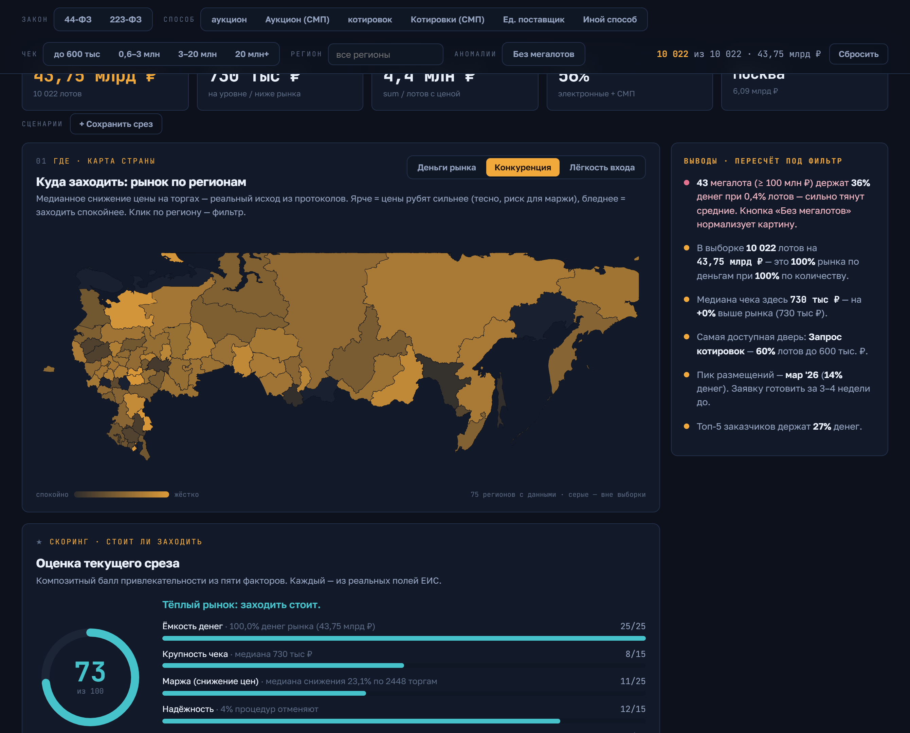

# Радар госзаказа

Интерактивный дашборд по рынку учебного оборудования в госзакупках: в какой регион идти поставщику, через какую процедуру заходить, с каким чеком и когда. В основе — 10 тысяч закупок из ЕИС, а для завершённых торгов добыт реальный исход: на сколько сбили цену на аукционе.

**[Открыть дашборд](https://escapist001.github.io/edu-procurement/)**



## Зачем

Я несколько лет работал в компании — производителе учебного оборудования (АО «А2 Система»), где часть сбыта идёт через госзакупки. Это огромный открытый массив данных, но у ЕИС нет удобного API, а готового среза именно по учебному оборудованию в открытом доступе не найти. Я собрал данные сам и превратил в инструмент, который отвечает на вопросы поставщика перед выходом на рынок. Каждый фильтр пересчитывает весь экран — гипотезу можно проверить вживую.

## Что здесь реальное, а не на глаз

Обычный парсер выдачи ЕИС даёт только «шапку» закупки — начальную цену и способ. Здесь пошёл дальше и добыл то, что закупку реально характеризует:

- **Снижение цены на торгах** — по каждой завершённой процедуре 44-ФЗ конвейер открывает протокол подведения итогов и берёт предложение победителя. Снижение от НМЦК — это прямой показатель конкуренции и риска для маржи: где цены рубят в ноль, туда лезть опасно. Собрано по нескольким тысячам торгов.
- **Регион заказчика — из структурных кодов, а не из названия.** Регион берётся из адреса организации и ИНН по справочнику ФНС, а не угадывается по строке имени. Это даёт чистую привязку и настоящую полигональную карту России.
- **Объём — 10 тысяч закупок**, а не первая страница выдачи: сбор идёт окнами по датам, потому что портал отдаёт не больше тысячи записей на один запрос.

## Как это работает

```
zakupki.gov.ru ──► конвейер на Python ──► rows.json ──► React-дашборд
   ЕИС (HTML)      сбор · регион · исход    все поля     своя карта + графики
```

Конвейер разбит на этапы, каждый возобновляемый (обрыв не теряет прогресс):

1. **`scrape_list.py`** — оконный обход расширенного поиска по запросам домена «учебное оборудование» (44-ФЗ и 223-ФЗ): номер, закон, способ, стадия, объект, заказчик, НМЦК, дата. → `base.csv` (10 022 записи).
2. **`resolve_regions.py`** — по уникальным заказчикам достаёт чистый регион (адрес / ИНН по коду ФНС). → `orgs.json` (85 регионов, без «не определён»).
3. **`scrape_outcomes.py`** — по завершённым торгам открывает протоколы и берёт цену победителя → снижение от НМЦК. → `outcomes.csv`.
4. **`scrape_winners.py`** — из реестра контрактов ЕИС достаёт реальных победителей: по каждому контракту открывает карточку и берёт поставщика (название, ИНН, статус СМП). Связывает с базой по номеру закупки → снижение и регион.
5. **`build.py`** — объединяет всё в `rows.json` и считает агрегаты: медиану снижения по сегментам и регионам, а также **досье поставщиков** (Индекс угрозы, архетип, оси розы).
6. **`prepare_map.py`** — готовит geojson субъектов РФ для полигональной карты.

Дашборд (`dashboard/`, Vite + React + TypeScript) читает `rows.json` и считает все срезы в браузере — без бэкенда.

## Что внутри

- **Полигональная карта России** в трёх режимах: где сосредоточены деньги, где сильнее конкуренция (по реальному снижению цены) и где легче зайти. Клик по региону — фильтр.
- **Досье конкурентов** — реальные победители госзакупок, ранжированные по «Индексу угрозы». Каждый профилируется по архетипу (Демпер / Свой человек / Гигант / Окопник / Спорадик), «Роза угрозы» (радар: цена, объём, темп, охват, окопанность против медианы рынка), а блок «Как играть» подсказывает стратегию против конкретной компании.
- **Живые фильтры** по закону, способу, ценовому сегменту (пороги из 44-ФЗ) и региону — с перекрёстной фильтрацией по любому графику.
- **Скоринг «стоит ли заходить»** — балл привлекательности среза из пяти факторов, где ключевой — маржа: реальное снижение цены на торгах, а не оценка «из головы».
- **What-if симулятор** захода в сегмент под свою команду и win-rate.
- **«Призрак рынка», автовыводы, матрица «способ × чек», сезонность, доля отмен, распределение чеков, Парето заказчиков** — каждый график про свой вопрос.
- Флаг мегалотов (≥ 100 млн ₽) с нормализацией, сохранение среза в адресе, экспорт в CSV, отчёт-сводка для печати.

## Стек

- **Python 3.12** — `requests` + `BeautifulSoup`, конвейер сбора с пулом потоков, обработкой rate-limit и возобновлением.
- **Vite + React + TypeScript** — дашборд. Карта и графики нарисованы вручную на SVG (своя проекция России, шкалы `d3-scale`), анимации — `framer-motion`. Всё в браузере.
- Хостинг — GitHub Pages (сборка в `docs/`).

## Запуск

```bash
pip install -r requirements.txt
python scrape_list.py --target 10000   # база из ЕИС
python resolve_regions.py              # чистый регион
python scrape_outcomes.py              # реальное снижение цены
python scrape_winners.py               # победители из реестра контрактов
python prepare_map.py                  # geojson карты
python build.py                        # → rows.json + агрегаты + досье

cd dashboard && npm install && npm run build   # сборка в ../docs
```

## Ограничения

- Снижение цены получено для завершённых процедур 44-ФЗ, у которых опубликован протокол с ценой; у идущих и несостоявшихся закупок исхода нет — это отражено честно, без домысливания.
- Морфология запроса захватывает и смежные закупки (мебель для классов, канцелярия) — осознанный охват «околоучебного» рынка.
- Сертификат ЕИС выдан УЦ вне стандартного хранилища, поэтому в сборщике отключена проверка TLS. Данные полностью открытые.

Дальше: коды ОКПД2/КТРУ для точной сегментации, накопление истории по неделям, пересечение «Индекса угрозы» с целевыми регионами пользователя.
