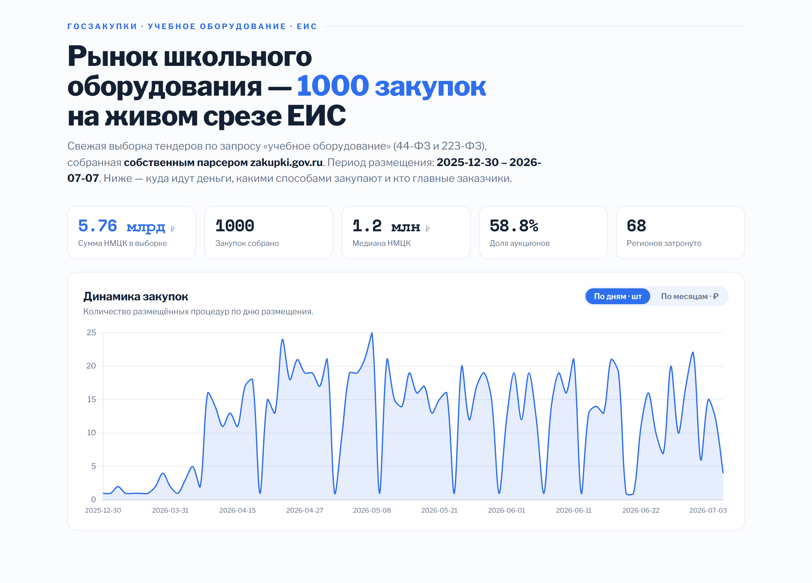

# 📊 Госзакупки учебного оборудования — аналитика ЕИС

Собственный парсер госзакупок России + аналитический дашборд: куда идут бюджеты на учебное оборудование, какими способами закупают, кто главные заказчики и в каких регионах.

**[▶ Живой дашборд](https://escapist001.github.io/edu-procurement/)**



## 🎯 Зачем

Я несколько лет работаю в компании — производителе учебного оборудования (АО «А2 Система»), где часть сбыта идёт через госзакупки. Публичные закупки в России — это огромный открытый массив данных, но у ЕИС нет удобного API, а готовых срезов именно по учебному оборудованию в открытом доступе нет. Поэтому я собрал данные сам и превратил их в аналитику своего рынка.

Это не «датасет по миру, который есть у всех» — это живой срез моего домена, собранный с нуля.

## 🔧 Как это работает

```
zakupki.gov.ru  ──parser.py──►  data/contracts.csv  ──analysis.py──►  docs/data.json  ──►  дашборд
  (HTML выдачи)   requests+bs4       (1000 записей)       pandas          (агрегаты)        Chart.js
```

1. **`parser.py`** — у ЕИС нет открытого API, но страницы расширенного поиска отдаются как обычный HTML. Парсер по запросу «учебное оборудование» (44-ФЗ + 223-ФЗ) проходит страницы выдачи и вытаскивает из каждой карточки: номер, закон, способ, стадию, объект, заказчика, НМЦК, дату и регион (эвристика по названию заказчика).
2. **`analysis.py`** — pandas считает сводные метрики, распределения по способам и законам, ценовые корзины, динамику по датам, топ заказчиков и регионов → `docs/data.json`.
3. **Дашборд** (`docs/index.html`) — рендерит данные на Chart.js.

## 📈 Что показывает

- Сумма НМЦК, число закупок, медиана цены, доля аукционов, охват регионов
- Динамика закупок с переключателем: **по дням (штуки)** ⇄ **по месяцам (рубли)**
- Способы закупки (аукцион / запрос котировок / у единственного поставщика …)
- Соотношение 44-ФЗ и 223-ФЗ
- Распределение цен контрактов по корзинам
- **Средний чек по способу закупки** — где сидят крупные лоты
- **Стадии процедур** — на каком этапе находятся закупки
- Топ регионов и крупнейшие заказчики

Интерфейс — в духе дата-журналистики: числа-одометры, появление блоков и графиков по мере прокрутки, всё уважает `prefers-reduced-motion`.

## 🧰 Стек

- **Python 3.12** — `requests` + `BeautifulSoup` (парсер), `pandas` (анализ)
- **Chart.js** + ванильный JS для дашборда, без сборки
- Хостинг дашборда — GitHub Pages (статика)

## 🚀 Запуск

```bash
pip install -r requirements.txt

python parser.py --pages 20     # собрать свежий срез из ЕИС (≈1000 записей)
python analysis.py              # посчитать агрегаты → docs/data.json

cd docs && python -m http.server 8000   # открыть http://localhost:8000
```

## 🗂 Структура

```
edu-procurement/
├── parser.py           # парсер ЕИС (zakupki.gov.ru) → CSV
├── analysis.py         # pandas-анализ → docs/data.json
├── data/contracts.csv  # собранный срез
├── docs/               # дашборд (GitHub Pages)
│   ├── index.html
│   └── data.json
└── requirements.txt
```

## 📌 Честно о проекте

- **Это снимок выборки**, а не вся генеральная совокупность: парсер берёт первые ~1000 записей свежей выдачи по ключевому запросу. Для полноты можно увеличить `--pages` и добавить фильтры по ОКПД2/КТРУ.
- **Регион — эвристика** по названию заказчика (разбор строки), возможны неточности и «не определён».
- Запрос идёт с морфологией по ключу «учебное оборудование», поэтому в выборку попадают и смежные закупки (канцелярия, мебель для классов) — это осознанный охват «околоучебного» рынка.
- Сертификат ЕИС выдан российским УЦ, которого нет в стандартном хранилище, поэтому в парсере отключена проверка TLS (`verify=False`) — данные полностью открытые.

Что развить дальше: фильтр по кодам ОКПД2/КТРУ, накопление истории по неделям, карта России по регионам, разбор позиций спецификаций.
